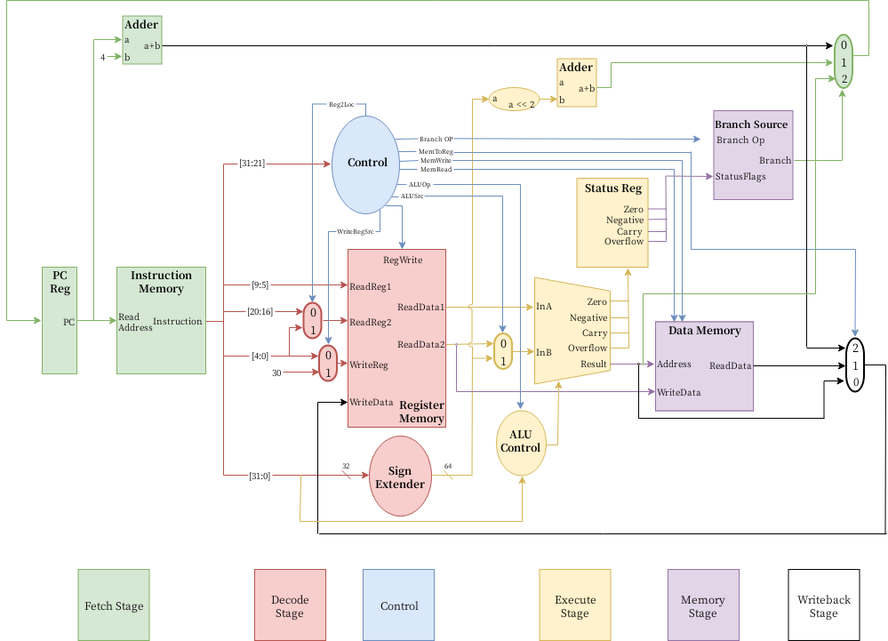

# LEGv8 Processor

This is a very simple implementation of a LEGv8 Processor, which is a subset of ARMv8. The goal of this project is to implement most (preferably all) of the information contained in the [LEGv8 Reference Guide](resources/LEGv8_Reference.pdf). 

## Motivation

This project was originally created as part of ELC 3338 at Baylor University. I heavily enjoyed the project, and chose to continue the development of the processor on my own.

_Sidenote to any possible ELC 3338 students who have stumbled across this repository: I've made certain choices to intentionally make this repository hard to copy from. I'd recommend not copying anything from this repo._

## Projects

There are three projects in this repository:

- nonpipelined/: This is the single-stage, nonpipelined version of the processor.
- pipelined/: (TODO) This is the pipelined version of the processor, with no data forwarding or hazard protection.
- pipelined-forward-hazard/: (TODO) This is the pipelined version of the processor, with both data forwarding and hazard protection.

## Hardware Hierarchy

Nonpipelined:
 
 

## Instructions

Initially, this project supported eight instructions: `ADD`, `SUB`, `AND`, `ORR`, `LDUR`, `STUR`, `B`, `CBZ`. The goal is to eventually support all of the instructions referenced in the [LEGv8 Reference Guide](resources/LEGv8_Reference.pdf). These are as follows:

- [x] ADD
- [x] ADDI
- [x] ADDIS
- [x] ADDS
- [x] AND
- [x] ANDI
- [x] ANDIS
- [x] ANDS
- [x] B
- [x] B.cond
- [ ] BL
- [ ] BR
- [x] CBNZ
- [x] CBZ
- [x] EOR
- [x] EORI
- [x] LDUR
- [x] LDURB
- [x] LDURH
- [x] LDURSW
- [ ] LDXR
- [ ] LSL
- [ ] LSR
- [ ] MOVK
- [ ] MOVZ
- [x] ORR
- [x] ORRI
- [x] STUR
- [x] STURB
- [x] STURH
- [x] STURW
- [ ] STXR
- [x] SUB
- [x] SUBI
- [x] SUBIS
- [x] SUBS
- [x] CMP
- [x] CMPI
- [ ] LDA
- [ ] MOV
- [ ] FADDS
- [ ] FADDD
- [ ] FCMPS
- [ ] FCMPD
- [ ] FDIVS
- [ ] FDIVD
- [ ] FMULS
- [ ] FMULD
- [ ] FSUBS
- [ ] FSUBD
- [ ] LDURS
- [ ] LDURD
- [ ] MUL
- [ ] SDIV
- [ ] SMULH
- [ ] STURS
- [ ] STURD
- [ ] UDIV
- [ ] UMULH

## Other features

Other things that I would like to implement are:

- [ ] Floating point registers
- [x] Status flag register
